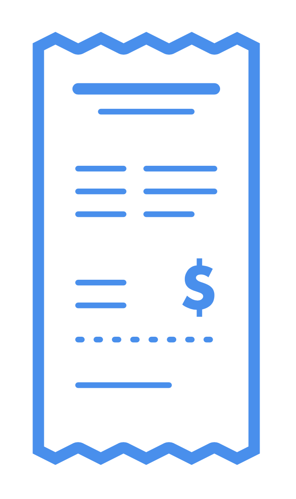

<!--
*** Thanks for checking out this README Template. If you have a suggestion that would
*** make this better, please fork the repo and create a pull request or simply open
*** an issue with the tag "enhancement".
*** Thanks again! Now go create something AMAZING! :D
***
***
***
*** To avoid retyping too much info. Do a search and replace for the following:
*** github_username, repo, twitter_handle, email
-->


<!-- PROJECT SHIELDS -->
<!--
*** I'm using markdown "reference style" links for readability.
*** Reference links are enclosed in brackets [ ] instead of parentheses ( ).
*** See the bottom of this document for the declaration of the reference variables
*** for contributors-url, forks-url, etc. This is an optional, concise syntax you may use.
*** https://www.markdownguide.org/basic-syntax/#reference-style-links
-->
<!-- [![Contributors][contributors-shield]][contributors-url]
[![Forks][forks-shield]][forks-url]
[![Stargazers][stars-shield]][stars-url]
[![Issues][issues-shield]][issues-url]
[![MIT License][license-shield]][license-url]
[![LinkedIn][linkedin-shield]][linkedin-url] -->


<!-- PROJECT LOGO -->
<br />
<p align="center">
  <a href="https://github.com/hivestrung/hack-kings-6.0">
    
  </a>
  <h2 align="center">TabWise</h3>

  <h3 align="center">
    Scan it, Say it, Split it!
  </p>
</p>


<!-- TABLE OF CONTENTS -->
## Table of Contents

- [Table of Contents](#table-of-contents)
- [About The Project](#about-the-project)
  - [Built With](#built-with)
- [How it Works](#how-it-works)
  - [Step 1. Scan it!](#step-1-scan-it)
  - [Step 2. Say it!](#step-2-say-it)
  - [Step 3. Split it!](#step-3-split-it)
- [Ideas for Improvements](#ideas-for-improvements)
- [Getting Started](#getting-started)
  - [Prerequisites](#prerequisites)
  - [Installation](#installation)
- [Contributing](#contributing)
- [License](#license)
- [Contact & Acknowledgements](#contact--acknowledgements)


<!-- ABOUT THE PROJECT -->
## About The Project

[![Product Name Screen Shot][product-screenshot]](https://example.com)


### Built With

<a href="[www.nodejs.org](https://nodejs.org/en/)" target="_blank"></a>  
<a href="w[ww.nodejs.org](http://mongodb.com)" target="_blank"></a>  
<a href="http://tabscanner.com" target="_blank"></a>

<!-- USAGE EXAMPLES -->
## How it Works

Imagine you're at a restaurant with a large group of people. One ordered a Carbonara and a glass of Sauvignon Blanc. Another ordered a Flat Iron Steak and a Malbec. Someone else ordered a basket of Chicken Wings and split it with three other people. You shared a bottle of Prosecco with two other people. The list goes on...

How do you split it!?

Here are your options:  
A. Just split it equally amongst yourselves.  
B. Manually calculate everything and add it into SplitWise or some expenses sharing app. 

A is not always going to be fair, and B is tedious.

Enter `TabWise`, an end-to-end solution to this age-old problem!

With 3 easy steps you can get on with your life and do more important things!

### Step 1. Scan it!
One person, let's say you, has paid the bill. Simply navigate to our website, and scan the receipt using your phone. No cropping needed, no messing about - just scan it!

### Step 2. Say it!
We'll give you a simple, readable and sayable link. Get your friends to visit the link by simply saying it out loud!

### Step 3. Split it!
On the website, everyone selects the receipt items that they were involved in. Once we verify that everything tallies, everyone gets a unique, customised link to pay you exactly what they owe you!

<!-- ROADMAP -->
## Ideas for Improvements

<!-- See the [open issues](https://github.com/hivestrung/hack-kings-6.0/issues) for a list of proposed features (and known issues). -->

We are not currently actively developing this, but here are some of our ideas to take this idea further.

- Enable more granular splitting (e.g. a bottle of wine being split into 1/3 and 2/3 instead of half-half)
- Integrate with SplitWise
- Integrate with other banks

<!-- GETTING STARTED -->
## Getting Started

To get a local copy up and running follow these simple steps.

### Prerequisites

This is an example of how to list things you need to use the software and how to install them.
* npm
```sh
npm install npm@latest -g
```

### Installation
 
1. Clone the hack-kings-6.0
```sh
git clone https://github.com/hivestrung/hack-kings-6.0.git
```
2. Install NPM packages
```sh
npm install
```


<!-- CONTRIBUTING -->
## Contributing

Contributions are what make the open source community such an amazing place to be learn, inspire, and create. Any contributions you make are **greatly appreciated**.

1. Fork the Project
2. Create your Feature Branch (`git checkout -b feature/AmazingFeature`)
3. Commit your Changes (`git commit -m 'Add some AmazingFeature'`)
4. Push to the Branch (`git push origin feature/AmazingFeature`)
5. Open a Pull Request


<!-- LICENSE -->
## License

Distributed under the MIT License. See `LICENSE` for more information.


<!-- CONTACT -->
## Contact & Acknowledgements

[Shiv Godhia](https://github.com/hivestrung)  
[Huey Lee](https://github.com/hueyy)  
[Gao Shan Sam](https://github.com/firemansamm)

Project Link: [https://github.com/hivestrung/hack-kings-6.0](https://github.com/hivestrung/hack-kings-6.0)
