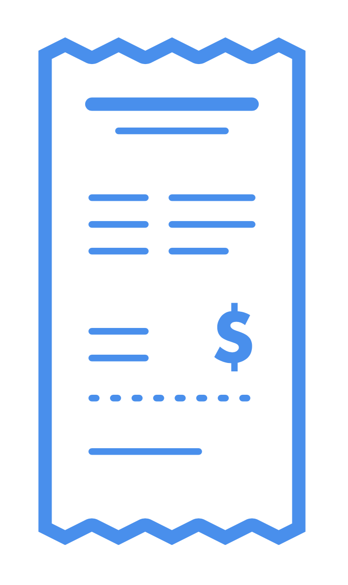
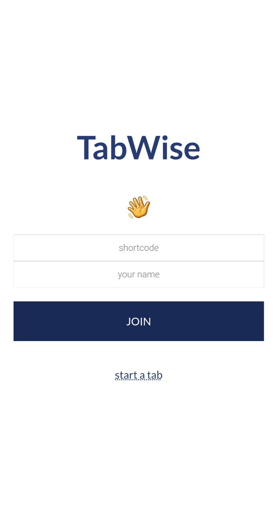
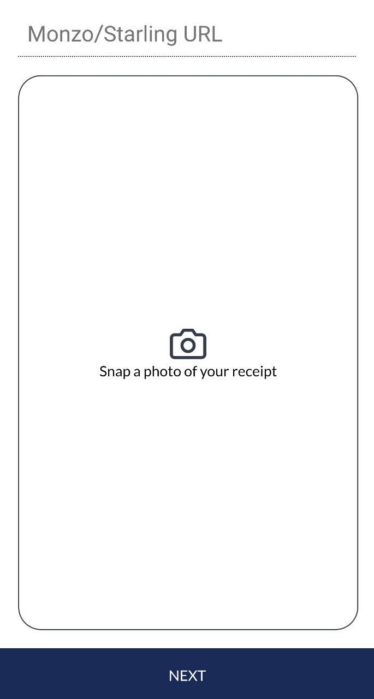
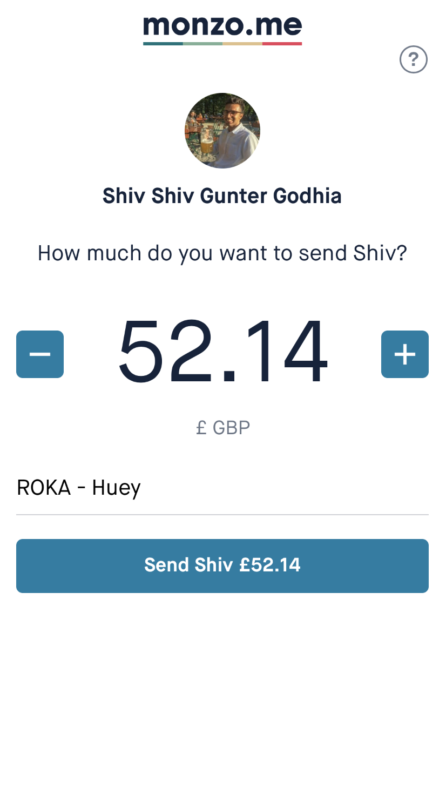
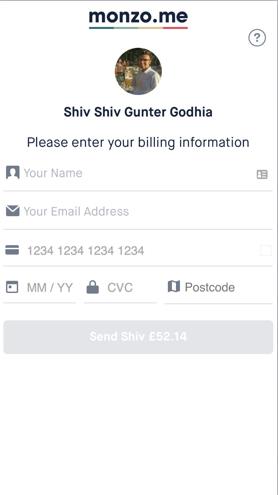
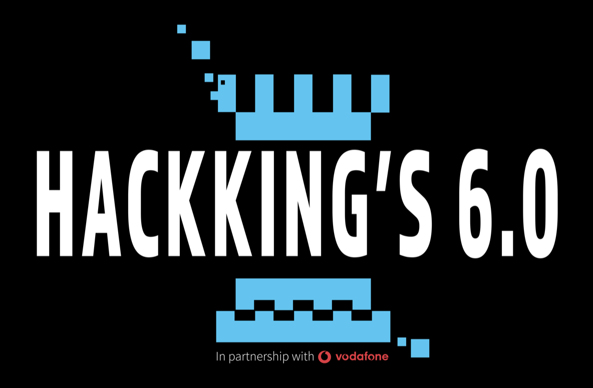

<!-- PROJECT LOGO -->
<br />
<p align="center">
  <a href="https://github.com/hivestrung/hack-kings-6.0">
    
  </a>
  <h2 align="center">TabWise</h3>

  <h3 align="center">
    Scan it, Say it, Split it!
  </p>
</p>


<!-- TABLE OF CONTENTS -->
## Table of Contents

- [Table of Contents](#table-of-contents)
- [In a Nutshell](#in-a-nutshell)
- [How it Works](#how-it-works)
  - [Step 1. Scan it!](#step-1-scan-it)
  - [Step 2. Say it!](#step-2-say-it)
  - [Step 3. Split it!](#step-3-split-it)
- [Demo Video](#demo-video)
- [Ideas for Improvements](#ideas-for-improvements)
- [Built With](#built-with)
- [Getting Started](#getting-started)
  - [Prerequisites / Dependencies](#prerequisites--dependencies)
  - [Installation](#installation)
- [Contributing](#contributing)
- [License](#license)
- [Contact & Acknowledgements](#contact--acknowledgements)


<!-- ABOUT THE PROJECT -->
## In a Nutshell
TabWise aims to help you split the bill - even faster and simpler than ever before! What we offer that's different from competitors is an end-to-end solution requiring no maths, no user accounts, and promising instant and free payments via card. Interested? Read on to find out more...

<!-- USAGE EXAMPLES -->
## How it Works

Imagine you're at a restaurant with a large group of people. One ordered a Carbonara and a glass of Sauvignon Blanc. Another ordered a Flat Iron Steak and a Malbec. Someone else ordered a basket of Chicken Wings and split it with three other people. You shared a bottle of Prosecco with two other people. The list goes on...

*How do you split it!?*

Here are your options:  
A. Just split it equally amongst yourselves.  
B. Manually calculate everything and add it into SplitWise or some expenses sharing app. 

A is not always going to be fair, and B is tedious.

Enter `TabWise`, an end-to-end solution to this age-old problem!

With 3 easy steps you can get on with your life and do more important things!

### Step 1. Scan it!
One person, let's say you, has paid the bill. Simply navigate to our website, and scan the receipt using your phone. No cropping needed, no messing about - just scan it!





### Step 2. Say it!
We'll give you a simple, readable and sayable link. Get your friends to visit the link by simply saying it out loud!

- TODO: insert screenshot here

### Step 3. Split it!
On the website, everyone selects the receipt items that they were involved in. Once we verify that everything tallies, everyone gets a unique, customised link to pay you exactly what they owe you!





## Demo Video


[Click here to watch](media/tabwise-demo-video.mov)

<!-- ROADMAP -->
## Ideas for Improvements

<!-- See the [open issues](https://github.com/hivestrung/hack-kings-6.0/issues) for a list of proposed features (and known issues). -->

We are not currently actively developing this, but here are some of our ideas to take this idea further.

- Enable more granular splitting (e.g. a bottle of wine being split into 1/3 and 2/3 instead of half-half)
- Integrate with SplitWise
- Integrate with and support other banks
- Allow for persistent accounts (while continuing to support users who don't have accounts)
- Universal payment service that is not dependent on individual banks

Have an idea or want to try building one of these features? Feel free to [contribute](#contributing)!

## Built With

<a href="https://nodejs.org/en/" target="_blank"></a>  
<a href="http://mongodb.com" target="_blank"></a>  
<a href="http://tabscanner.com" target="_blank"></a>  
<a href="https://monzo.com" target="_blank"></a>

<!-- GETTING STARTED -->
## Getting Started

To get a local copy up and running follow these simple steps.

### Prerequisites / Dependencies

* npm
```sh
npm install npm@latest -g
```
* API key for TabScanner  

Just go [here](https://admin.tabscanner.com/register) and sign up for a free account to get an API key.

* Monzo account for the original payer

Just go [here](https://monzo.com) and sign up for a free account.

### Installation
 
1. Clone the repo
```sh
git clone https://github.com/hivestrung/hack-kings-6.0.git
```
2. Install NPM packages
```sh
npm install
```
3. 


<!-- CONTRIBUTING -->
## Contributing

Contributions are what make the open source community such an amazing place to be learn, inspire, and create. Any contributions you make are **greatly appreciated**.

1. Fork the Project
2. Create your Feature Branch (`git checkout -b feature/AmazingFeature`)
3. Commit your Changes (`git commit -m 'Add some AmazingFeature'`)
4. Push to the Branch (`git push origin feature/AmazingFeature`)
5. Open a Pull Request


<!-- LICENSE -->
## License

Distributed under the MIT License. See `LICENSE` for more information.


<!-- CONTACT -->
## Contact & Acknowledgements


[Gao Shan Sam](https://github.com/firemansamm), [Huey Lee](https://github.com/hueyy) and [Shiv Godhia](https://github.com/hivestrung) built this at Hack King's 6.0.

Thanks go out to [KCL Tech Society](https://kcl.tech/) for organising the hackathon and for providing the space for us to build TabWise!

<a href="https://hackkings.org" target="_blank"></a> 


[Project Link][project link]


[project link]: https://github.com/hivestrung/hack-kings-6.0
